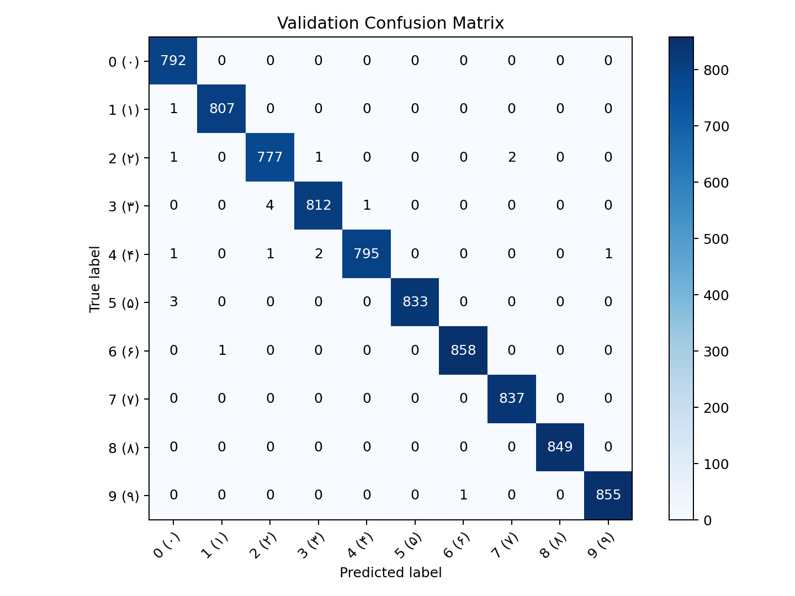
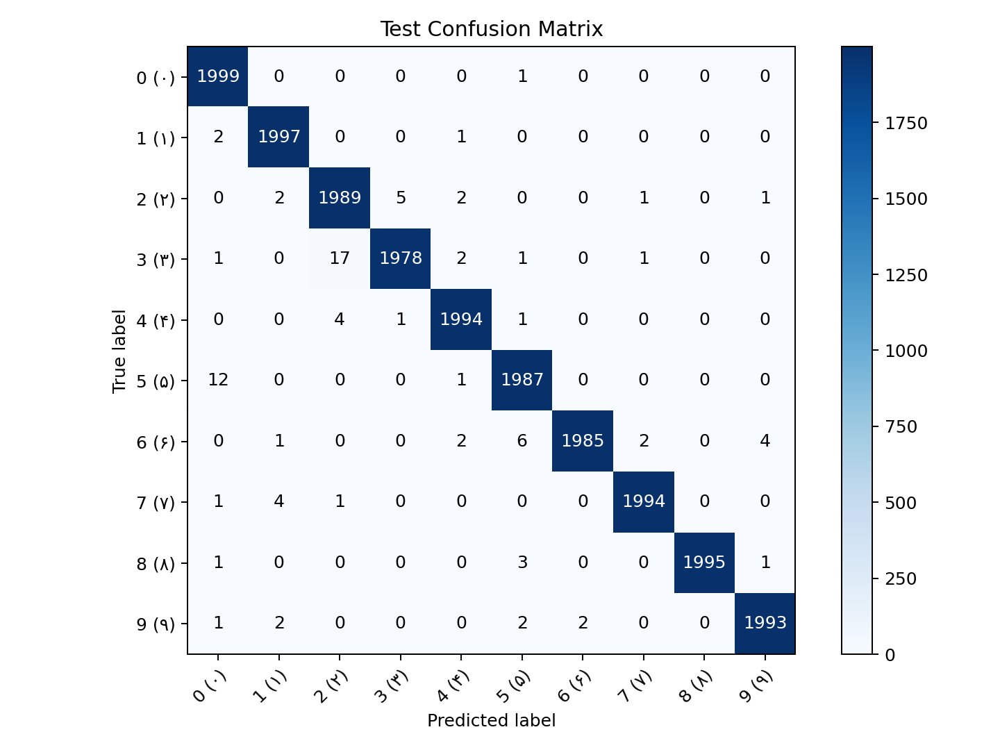

# Persian Digit Recognizer (PyTorch)

Custom CNN for Persian digit classification (`0..9`) with training, evaluation, and single-image prediction scripts.

## Model

- `PersianDigitCNN` (custom CNN)
- `Conv(1->32) + BatchNorm + ReLU + MaxPool`
- `Conv(32->64) + BatchNorm + ReLU + MaxPool`
- `Conv(64->128) + BatchNorm + ReLU + MaxPool`
- `AdaptiveAvgPool(3x3)`
- `Flatten -> Linear(1152->256) -> ReLU -> Dropout(0.3) -> Linear(256->10)`
- Loss: `CrossEntropyLoss`
- Optimizer: `AdamW`

## Setup

```bash
cd /Users/danial/llm/ml
# if not cloned yet:
# git clone https://github.com/danialza/CNN-based-Persian-digit-recognizer-built-with-PyTorch.git persian-digit-recognizer
cd persian-digit-recognizer
python3 -m venv .venv
source .venv/bin/activate
pip install -r requirements.txt
```

## Prepare HODA dataset

```bash
git clone https://github.com/amir-saniyan/HodaDatasetReader.git

python prepare_hoda.py \
  --hoda-reader-path HodaDatasetReader/HodaDatasetReader.py \
  --digitdb-dir HodaDatasetReader/DigitDB \
  --output-dir dataset_hoda \
  --include-remaining \
  --overwrite
```

## Train

```bash
export MPLCONFIGDIR=/tmp/matplotlib
export XDG_CACHE_HOME=/tmp/.cache

python train.py \
  --dataset-dir dataset_hoda \
  --output-dir runs/hoda-exp1 \
  --epochs 10 \
  --batch-size 128 \
  --num-workers 0
```

## Evaluate

```bash
python evaluate.py \
  --dataset-dir dataset_hoda \
  --model-path runs/hoda-exp1/best_model.pt \
  --split test \
  --batch-size 128 \
  --num-workers 0 \
  --output-dir runs/hoda-exp1
```

## Predict one image

```bash
python predict.py \
  --model-path runs/hoda-exp1/best_model.pt \
  --image-path /absolute/path/to/image.png \
  --top-k 3
```

## Experiment summary

- Data paths used:
- `HodaDatasetReader/DigitDB`
- `dataset_hoda`
- Output path:
- `runs/hoda-exp1`
- Training example log:
- `Epoch 01/10 | train_loss=0.1337 train_acc=0.9568 | val_loss=0.0312 val_acc=0.9902`
- Final result:
- `best_val_acc=0.9976`
- `test_loss=0.0169`
- `test_acc=0.9956` (`99.56%`)
- Confusion matrices:
- `runs/hoda-exp1/val_confusion_matrix.png`
- `runs/hoda-exp1/test_confusion_matrix.png`

### Validation confusion matrix



### Test confusion matrix


